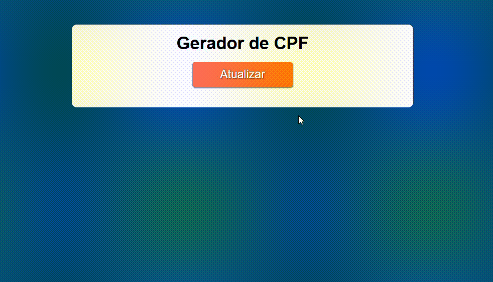

<h1>Gerador de CPF</h1>

Esse projeto é um gerador de CPFs válidos desenvolvido para web. Ele foi construído com HTML, CSS e JavaScript, utilizando Webpack e Babel para garantir compatibilidade com diferentes navegadores.

<h2>Estrutura do projeto</h2>
<pre>
CPF-GENERATOR/
├── docs/							# Arquivos finais (utilizados para funcionamento do projeto e para deploy)
│	├── assets/
│	│   └── js/
│	│       ├── bundle.js					# Script final
│	│       └── bundle.js.map				# Mapa de bundle.js
│	└── index.html						# Página principal 
│
├── src/							# Códigos-fonte
│   └── assets/
│       ├── css/
│       │   └── style.css					# Arquivo de estilo
│       ├── img/
│	│   └── [imagem]					# Imagem utilizada no projeto
│       └── js/
│           ├── module/						# Scripts modularizados
│           │   ├── GenerateCpf.js
│           │   └── ValideCpf.js
│           └── main.js						# Script principal
│
├── package-lock.json						# Versiona as dependências exatas do projeto
├── package.json						# Informações do projeto, dependências e scripts npm
└── webpack.config.js						# Configurações do Webpack
</pre>

Alguns arquivos e pastas foram omitidos por não serem essenciais para a compreensão da estrutura do projeto.

<h2>Tecnologias utilizadas</h2>
<ul>
	<li>HTML5</li>
	<li>CSS3</li>
	<li>JavaScript ES6+</li>
	<li>Node.js v20.17.0</li>
	<li>Node Package Manager (npm) ^10.8.2</li>
	<li>Webpack ^5.98.0</li>
	<li>Babel ^7.26.9</li>
	<li>core-js ^3.40.0</li>
	<li>regenerator-runtime ^0.14.1</li>
	<li>css-loader ^7.1.2</li>
	<li>style-loader ^4.0.0</li>
 	<li>Visual Studio Code v1.99.2</li>
</ul>

<h2>Funcionalidades</h2>
<ul>
	<li><strong>Gera CPFs válidos</strong>: com apenas um clique, o sistema gera e exibe um CPF válido em formato convencional.</li>
	<li><strong>Compatibilidade em navegadores</strong>: o gerador de CPF funciona em diferentes navegadores.</li>
</ul>

<h2>Demosntração das funcionalidades</h2>

	

<h2>Como rodar o projeto em diferentes ambientes</h2>

Para executar este projeto, é necessário ter os seguintes pré-requisitos:

<ul>
	<li>Node.js - Versão mínima recomendada: 20.x ou superior.</li>
	<li>Node Package Manager (npm) - Versão mínima recomendada: 10.x ou superior.</li>
</ul>

Passo-a-passo:

<ol>
	<li>Instale <code>Node.js</code> clicando <a href="https://nodejs.org/en/download" target="_blank">aqui</a>.</li>
	<li>Navegue até o diretório pretendido:</li>
	<pre><code>cd caminho/do/diretorio</code></pre>
	<li>No diretório escolhido, clone o repositório:</li>
	<pre><code>git clone https://github.com/MatheusVenturaNellessen/cpf-generator.git</code></pre>
	<li>Instale as dependências necessárias do projeto:</li>
	<pre><code>npm install</code></pre>
	
Após o comando, a pasta <code>node_modules</code> com todas as dependências será criada em seu ambiente.

	<li>Abra o aqruivo <code>index.html</code> dentro da pasta <code>docs/</code> em um navegador.</li>
</ol>

Para gerar arquivos finais novamente após alterações, execute o comando:

<pre><code>npm run build</code></pre>

<h2>Contribuições</h2>

Este projeto está aberto para contribuições através de issues. Caso você tenha encontrado um bug, queira sugerir uma melhoria ou tenha dúvidas sobre o funcionamento do projeto, por favor, siga as instruções abaixo:

<ol>
    <li>Verifique se já existe uma issue da situação aberta. Se já existir, adicione seu comentário na issue existente.
    <li>Caso não tenha sido aberta, crie uma issue nova.
</ol>

<h2>Licença e Autor</h2>

Este projeto foi desenvolvido por <a href="https://www.linkedin.com/in/matheus-ventura-nellessen/">Matheus Ventura Nellessen</a> e está licenciado sob a licença MIT. Veja o <a href="./LICENSE">documento</a> para mais detalhe.

